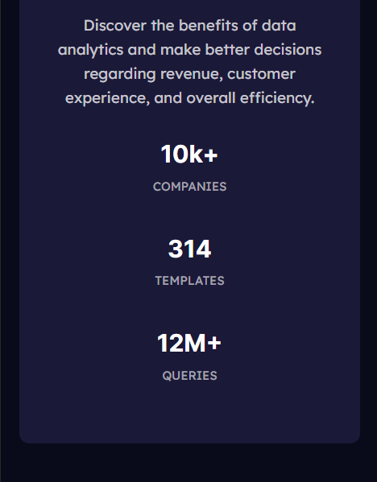

# Frontend Mentor - Stats preview card component solution

This is a solution to the [Stats preview card component challenge on Frontend Mentor](https://www.frontendmentor.io/challenges/stats-preview-card-component-8JqbgoU62). Frontend Mentor challenges help you improve your coding skills by building realistic projects.

### The challenge

Users should be able to:

- View the optimal layout depending on their device's screen size

### Screenshot

Desktop version

Mobile version

### Links

- Solution URL: [GitHub](https://github.com/marco-moya/Stats-preview-card-component)
- Live Site URL: [GitHub Pages](https://marco-moya.github.io/Stats-preview-card-component)

### Built with

- Semantic HTML5 markup
- CSS custom properties
- Flexbox
- CSS Grid
- Mobile-first workflow

## Author

- Frontend Mentor - [@marco-moya](https://www.frontendmentor.io/profile/marco-moya)
